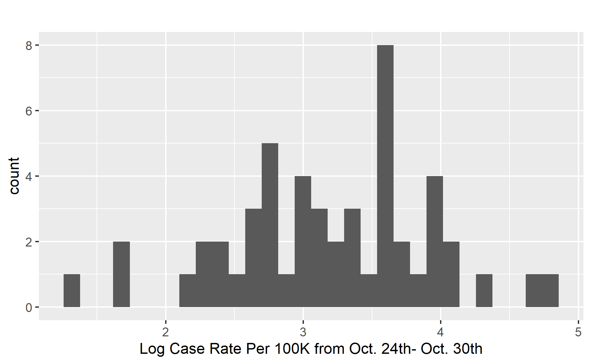
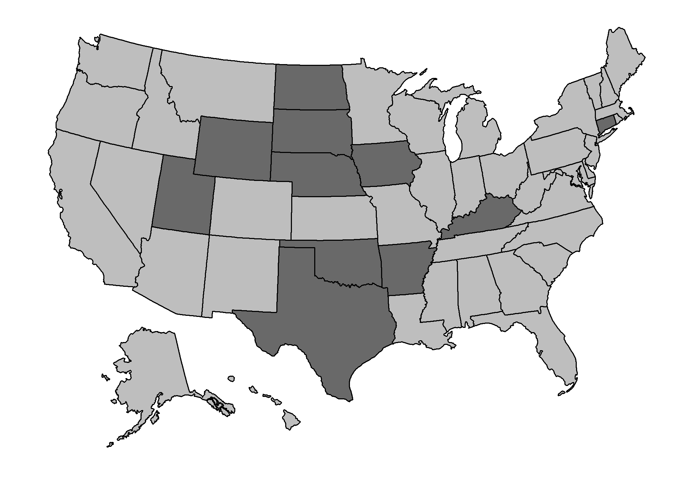
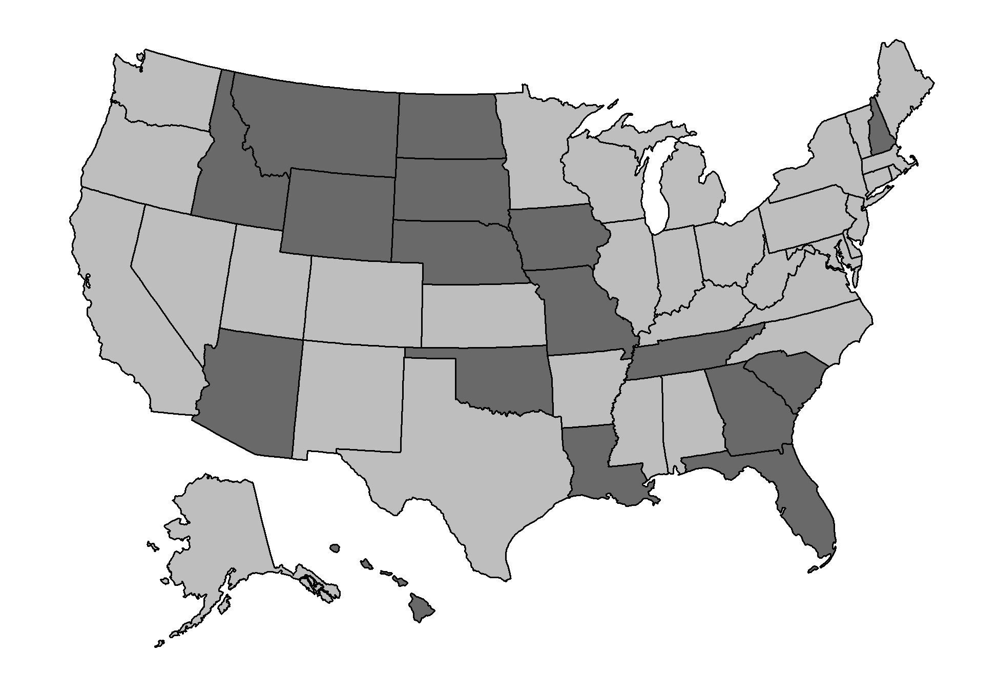
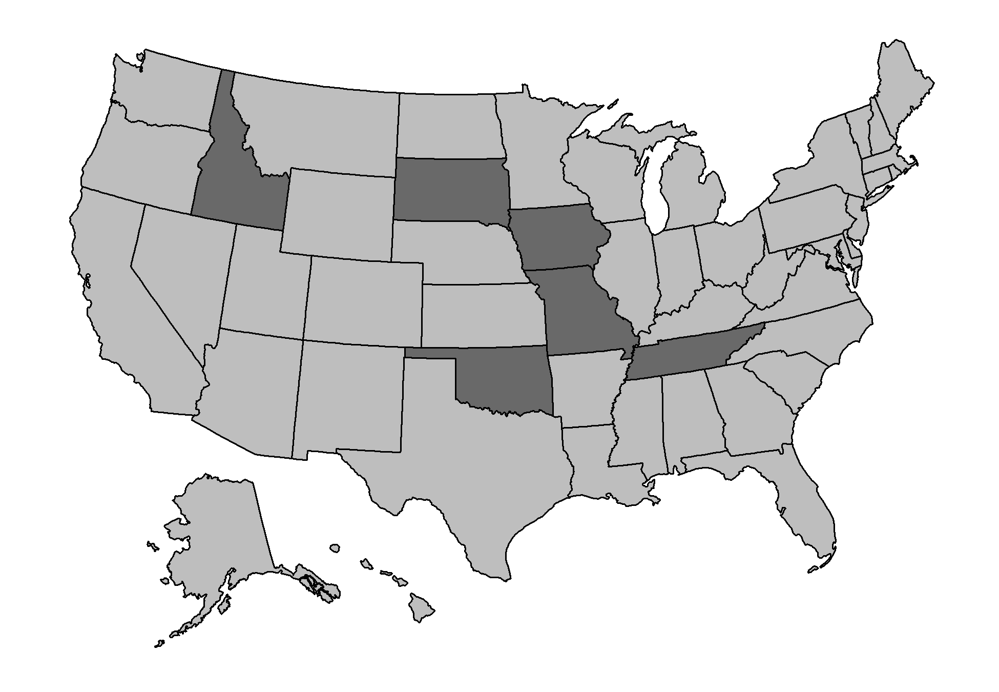
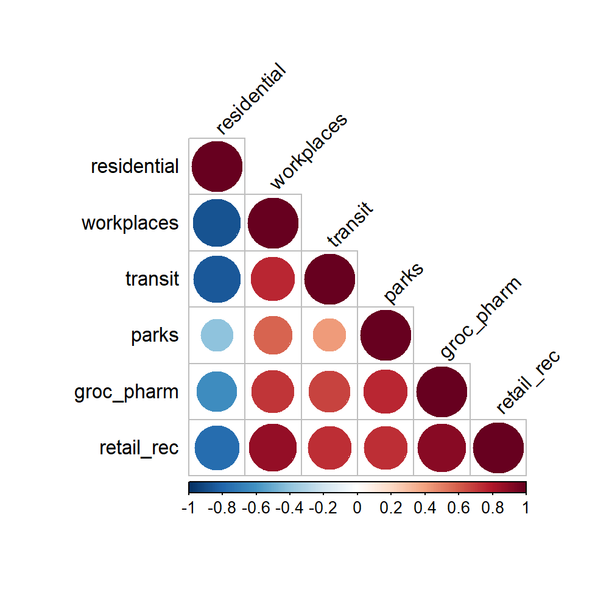
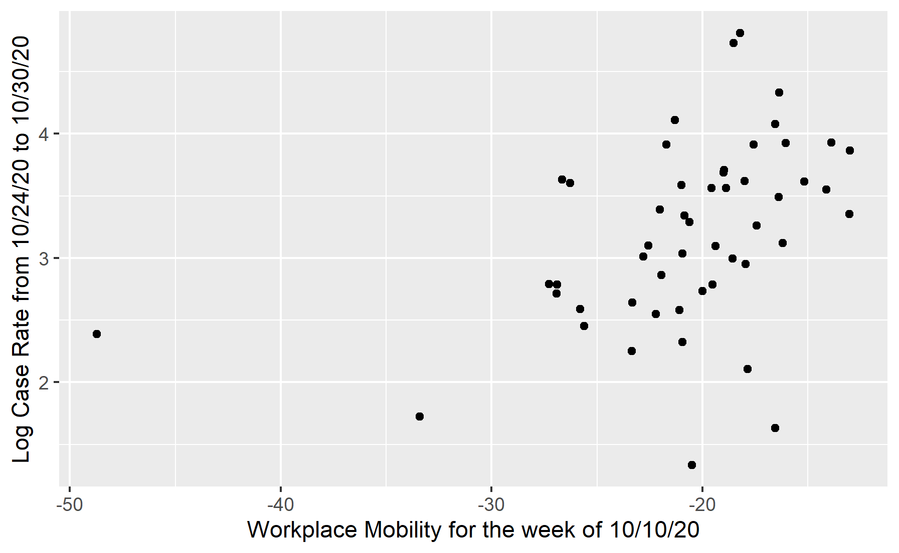
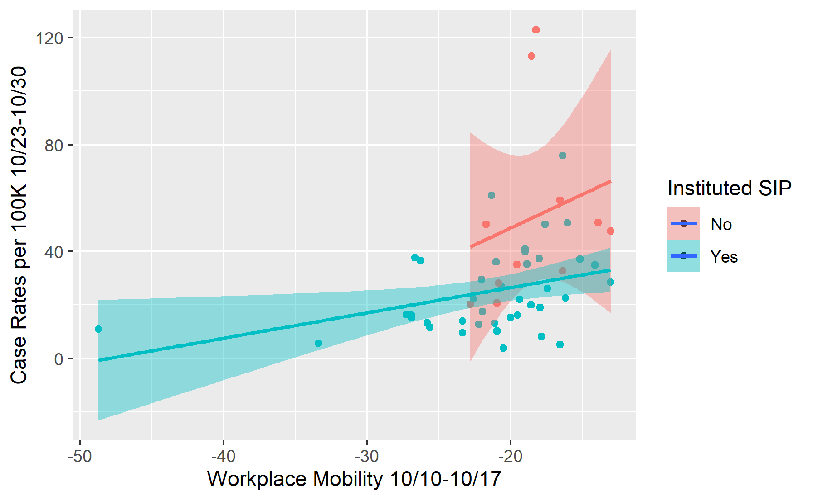
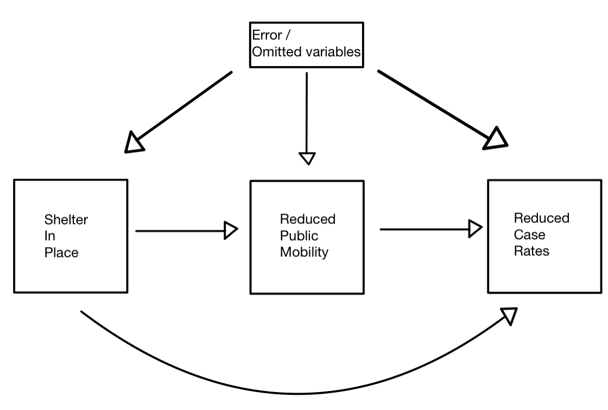

```{r setup, include=FALSE}
knitr::opts_chunk$set(echo = TRUE)
library(tidyverse) # Includes dplyr, ggplot2, tidyr, tibble, etc
library(corrplot)
source("http://www.sthda.com/upload/rquery_cormat.r") #for correlation matrix

```

# Introduction


There are few words that can succinctly describe the  collective grief, loss, and polarization Americans have experience in the year 2020 due to the COVID-19 pandemic, social justice movements, and a momentous election. We believe statistical evaluation and evidence-based research methodologies can support the incoming administration to enact data-based decisions on federal and state level policies on preventing the spread of COVID-19.

We seek to study: does the stated-mandated policy of Shelter In Place (SIP) anytime during the time period 3/20/20 - 10/30/20 explain or cause a reduction in the spread of COVID-19? Further, how effective is this policy in and of itself, when controlling for measures of factors such reduced mobility or state mandated use of personal protective equipment? 


The results of this analysis and a deeper insight into the Shelter In Place policy that took place in different states can help policy makers and governors support their states better in this time of crisis. Looking at the data, we can identify trends based on state and the individual policies/rules that were enforced and see how this influenced the number of COVID-19 cases that we see today. The insights from this work can be used to support decisions and drive strategies that help protect Americans and slow the spread of this virus. Citizens can also look at the results of this report to better understand the trends of COVID-19 with regards to the Shelter In Place policy. They can take it upon themselves to align their actions with the results, protect themselves and their families, and push for more policies that will reduce the case count and spread.

 
  
# Exploratory Data Analysis

- **Log Case Rate per 100K in the last 7 Days:** From the distribution of Log Case Rate per 100k over the past 7 days we can see the data is sparse but relatively normal. There were no missing or null values in this column. See Figure \@ref(fig:cases-last7days-hist)

```{r cases-last7days-hist, out.width='50%', fig.cap="Histogram of Log Case Rate per 100K in the last 7 Days", fig.align='center', echo=FALSE}

```


- **State-Mandated Shelter in Place Policy:** Based on the data, 11 states didn’t implement SIP policies whereas 40 states did (Washington D.C. included). There were no null or missing values in the data. See Figure \@ref(fig:us-shelter-in-place)

```{r us-shelter-in-place, out.width='50%', fig.cap="States that did not institute SIP in Dark Grey", fig.align='center', echo=FALSE}

```

- **State-Mandated Individual Face Mask Policy:** Based on the data, 17 states did not implement mandatory individual face mask policies, while 34 states did (including Washington D.C. included). There were no missing or null values in the data. See Figure \@ref(fig:us-NoFaceMask)

```{r us-NoFaceMask, out.width='50%', fig.cap="States that did not implement public face mask mandates in Dark Grey", fig.align='center', echo=FALSE}

```


- **State-Mandated Employee Face Mask Policy:** Based on the data, 6 states did not implement mandatory employee face mask policies, while 45 states did (Washington D.C. included). See Figure \@ref(fig:us-NoFaceMaskEmploy)

```{r us-NoFaceMaskEmploy, out.width='50%', fig.cap="States that did not implement employee face mask mandates in Dark Grey", fig.align='center', echo=FALSE}

```

- **Workplace Mobility & Other Mobility Measures Colinearity:** 

  - The public mobility measures (workplaces, retail and recreation, transit, grocery and pharmacy) which involve person to person contact are highly correlated while the private mobility measure (residential mobility) which do not involve as much person to person contact is very negatively related to public mobility measures. The mobility for `parks` introduces some ambiguity, it is unclear whether park mobility is considered private mobility (little person to person contact) or public mobility (high person to person contact). Thus we will not use the `parks` mobility measure. See Figure \@ref(fig:mobility-corr)


```{r mobility-corr, out.width='50%', fig.cap="Correlation Between Mobility Measures", fig.align='center', echo=FALSE}

```

- Since the public mobility measures are all highly correlated, we will use Workplace Mobility as a stand-in to represent all public mobility in our model calculations


- **Workplace Mobility vs. Log Case rate:** Figure \@ref(fig:workplace-cases) demonstrates that workplace mobility has high correlation with (and potential for explanatory power) the log case rate per 100k in the last 7 days. ($r = 0.41$)

```{r workplace-cases, out.width='50%', fig.cap="Relationship between Workplace Mobility and Log Cases per 100K from Oct 24- Oct 30th", fig.align='center', echo=FALSE}

```


- **Workplace Mobility vs Case Rate, based on SIP implementation:** Figure \@ref(fig:mob-cases-sip)   shows how the relationship between mobility and case rate visually (but not proven statistically) changes based on whether SIP was implemented or not ($r_{SIP} = 0.36$; $r_{NoSIP} = 0.23$). From this figure, it may suggest that the SIP variable may have alternative effects besides simply reducing mobility. However, the difference in the relationship in mobility and case rate based on whether states implemented SIP may also be a result of the different sample sizes of the SIP states (n = 40) and the no SIP states (n = 11).

```{r mob-cases-sip, out.width='50%', fig.cap="Workplace Mobility and COVID cases\n Grouped by whether the State instituted a Shelter in Place at anytime", fig.align='center', echo=FALSE}

```

\newpage
# Model Building Process

**Modeling Goals** Our goal of modeling is explanatory. We seek to understand the underlying causes of the spread of COVID-19 so that policy-makers can effectively utilize our findings in mitigating the spread and impacts of COVID-19.

Intuitively, we know that a governor signing off on legislation has no direct bearing on COVID-19 case rates; rather there are intermediate causal chains between the two that would make the policy effective.

Shelter in Place policies were enforced to reduce public mobility which reduces the impact of contact and spread of the disease. 

This begs the question: if we control for mobility, and shelter in place remains a significant explanatory variable for case rates, what other causal links between the policy and outcome could there be?

**Outcome Variable:** We  operationalize ‘spread of COVID-19’ by looking at current case rates through the measured variable ‘case rate in the last 7 days per 100k.’ This variable normalizes for population differences between states and operationalizes the concept of interest, which is spread of COVID-19. Additionally, we chose the 7 day time period because we wanted to gain a more accurate picture of COVID-19 spread by isolating COVID-19 case rate within a small period of time (7 days) versus using a variable that spanned a longer period of time. Specifically, this data was last pulled on 10/30/2020. We wanted to have the most updated data as possible, so the outcome variable is thus case rate per 100k during the week of 10/24/2020-10/30/2020.

**Independent Variable:** presence of a state-mandated Shelter In Place policy (SIP).

- Further, we seek to determine the robustness of the SIP measure as an explanation for COVID case rate. Specifically, we are interested in SIP effectiveness independent of mobility measures and mandated personal protective equipment effects

**Causal Hypothesis:**

- We hypothesize that the presence (or non-presence) of an SIP order may be reflective of broader characteristics about the state.

- We acknowledge the many causal links that may occur in bidirectional ways between our variables of interest. Specifically, here is a working figure of our hypothesis about the relationships between our variables of interest. See Figure \@ref(fig:causal-graph)

```{r causal-graph, out.width='50%', fig.cap="Causal Links Diagram", fig.align='center', echo=FALSE}

```


-  SIP was instituted by states to directly decrease public mobility. If both SIP and mobility are included in the model as independent, and they are near perfectly collinear, then SIP should not remain robust as an explanatory variable of the outcome variable. If we find robustness of the SIP variable in the presence of controls, then we know the SIP variable causes a reduction in cases through means other than simply a reduction in mobility. 


**Other Covariates:** 

*Mobility Data:*

  - Existing public health recommendations are centered on how social distancing directly limits the spread of COVID-19 ([source](https://www.cdc.gov/coronavirus/2019-ncov/prevent-getting-sick/prevention.html?CDC_AA_refVal=https%3A%2F%2Fwww.cdc.gov%2Fcoronavirus%2F2019-ncov%2Fprepare%2Fprevention.html)). We believe measures of mobility directly measure how much individuals are social distancing.
  
  - Past studies ([source](https://www.nature.com/articles/s41586-020-2923-3)) indicate that mobility directly affects COVID-19 case counts. Furthermore, we specifically targeted mobility data that captured overall mobility 2 weeks before when our outcome variable was collected due to the incubation period of COVID-19 ([source](https://www.cdc.gov/coronavirus/2019-ncov/hcp/faq.html#:~:text=Based%20on%20existing%20literature%2C,2–14%20days.))
  
  - We acquired U.S. mobility data reports directly from the Google Community Mobility Report ([source](https://www.google.com/covid19/mobility/))
  
  - The data represented is Google’s measured percent change from the baseline measure of mobility in various categories including: workplaces, parks, retail & recreation centers, residential areas, grocery & pharmacy areas, and transit areas. The baseline data is calculated from “the median value from the 5‑week period Jan 3 – Feb 6, 2020” and percent changes differences are computed by comparing the target day of interest to a “normal value for that day of the week.” ([source](https://support.google.com/covid19-mobility/answer/9824897?hl=en&ref_topic=9822927))
  
  - We choose to add a mobility measure because we would like to absorb the effect of mobility on case rate to isolate impact of the SIP policy itself.
  
*State-mandated Individual Face Mask policy:* 

  - Existing public health recommendations also cite face masks as an effective way of preventing the spread of COVID-19 ([source](https://www.cdc.gov/coronavirus/2019-ncov/prevent-getting-sick/prevention.html?CDC_AA_refVal=https%3A%2F%2Fwww.cdc.gov%2Fcoronavirus%2F2019-ncov%2Fprepare%2Fprevention.html))
  
  - We hypothesize that the state-mandated individual face mask variable will explain some variance in the outcome variables as well as correlate with the SIP variable. We choose to add this variable because we would like to absorb the effect of state mandated face mask policy on case rate to isolate impact of the SIP policy itself.

*State-mandated employee face mask policy*

  - Existing public health recommendations also cite face masks worn by employees in businesses as an effective way of preventing the spread of COVID-19 ([source](https://www.cdc.gov/coronavirus/2019-ncov/prevent-getting-sick/prevention.html?CDC_AA_refVal=https%3A%2F%2Fwww.cdc.gov%2Fcoronavirus%2F2019-ncov%2Fprepare%2Fprevention.html))
  
  - We hypothesize that the state-mandated employee face mask variable will explain some variance in the outcome variables as well as correlate with the SIP variable. We choose to add this variable because we would like to absorb the effect of state mandated employee face mask policy on case rate to isolate impact of the SIP policy itself.
  
**Problematic Covariates**

*Mobility Categories:* there are 6 total categories for each region in the mobility data. Through EDA, we note that there exists multi-colinearity between each of the variables. We decided to use workplace mobility as a proxy for general out-of-home mobility as it is highly correlated with, for example, transit mobility ($\rho \approx 0.71$), Grocery/Pharmacy ($\rho \approx 0.69$), and retail/recreation ($\rho \approx 0.87$). Additionally it is very negatively correlated to mobility consistent with a Shelter in Place order, Workplace and residential mobility have a correlation of $\rho \approx -0.84$). See Figure \@ref(fig:mobility-corr) for a correlation map of the mobility measures.
  
*Mobility Time period Correlation:* there is high collinearity between mobility measures of weeks that are close in time period to one another. As such and based on previous evidence above, we opt to focus on 1 distinct week (10/10/20 - 10/17/20) which encapsulates 14-21 days prior to the start of the date range (10/24/20-10/30/20) of the outcome variable.
  
*Demographic Data* there are overall demographic differences between states. Research has also shown how COVID-19 disproportionately impacts communities of color in particular areas due to structural lack of resources. Although we would like to control for these demographic variations, the data provided includes many null values and/or values with large margins of error. As such, we will refrain from utilizing these covariates in this initial research. 
  
**Variable Transformations**

*Date Data Transformations*

  - *Indicators:* We computed indicator variables for policies based on the presence of date policy was enacted, retracted, or not.
  

  
*Mobility Data Transformations*

  - *Dataset:* The data for place identifiers in the dataset is disaggregated to the level of ‘sub_region_2’, which is county level data of mobility measures in different categories per day.
  
  - *Aggregate by State:* To transform the data, we first aggregated the data by grouping the rows by ‘sub_region_1’, which results in a dataset of state level data of mobility measures in different categories per day.
  
  - *Aggregate by Week:* Next, we aggregated over a weekly time period. Specifically, by grouping the rows using the ‘date’ columns, we took the average mobility of a category in a state over a given week from the weeks of 9/12/20 - 10/30/20. 
  
  - *Reasoning:* Existing research shows that symptoms of COVID-19 may not show up in an individual for at least 2 weeks from initial contraction of the disease. Thus the current day’s case rate might reflect individuals getting infected anywhere from 0-14 days prior to a positive test result. As such, we care about mobility measures 0-14 days prior to the outcome variable measurement. Since the outcome variable is measured over the period of 10/24/20 - 10/30/20, we choose to represent the mobility measures in the same weekly fashion.
 
 
# The Models

A state mandated shelter in place order requests citizens stay inside of their home (or vehicle for short term SIP) until officials announce it is safe to leave ([source: https://emergency.cdc.gov/shelterinplace.asp](https://emergency.cdc.gov/shelterinplace.asp) ). The COVID-19 shelter in place mandates request citizens stay inside their homes as much as possible, reducing trips to work, the grocery store, recreation, etc. We would like to measure the effect of SIP on current case rates while controlling for the main channels which SIP is meant to reduce the spread of COVID-19. 

First we estimate a simple baseline model to check the average relationship between instituting a SIP order and current case rates (October 24th - 30th). Then we iteratively add controls to try to isolate the direct effect of SIP on the latest spread of COVID-19:

The notation can be described as follows:

- $\log(Y_i)$ represent the log Case Rate per 100K from Oct 23rd to Oct 30th for each state $i$.

- $SIP_i$ Is a dummy variable that takes the value $1$ if the state has instituted a Shelter in Place _at any time_ 

- $WM_i$ represent workplace mobility for the week of Oct 12- Oct 19th

- $NPF_i$ is a dummy variable taking the value of $1$ if the state has _not_ instituted a Public Face Mask Mandate any time during the pandemic, $0$ otherwise

- $NEPF_i$ is a dummy variable taking the value of $1$ if the state has _not_ instituted an Employee Face mask Mandate at any time during the pandemic, $0$ otherwise. 

\begin{align}
  \log(Y_i) &= \beta_0 + \beta_1 SIP_i + \epsilon_i \\
  \log(Y_i) &= \beta_0 + \beta_1 SIP_i + \beta_2 WM_i + \epsilon_i\\
  \log(Y_i) &= \beta_0 + \beta_1 SIP_i + \beta_2 WM_i + \beta_3 NPF_i +  \epsilon_i\\
  \log(Y_i) &= \beta_0 + \beta_1 SIP_i + \beta_2 WM_i + \beta_3 NPF_i + \beta_4 NEPF_i + \epsilon_i
\end{align}


# Limitations of model

**Lack of External Validity**

  - Results from the model may not be completely generalizeable outside of this project

  - Many of the covariates we are using are time dependent (for example we are looking at October 10th workplace mobility data) - looking at this one date leads to a narrower subset of general claims we can make based on the model

  - Some of the other data is from 2018 (median annual household income, unemployment, poverty, etc), the results of the model may change based on more updated information

  - We also may be overlooking certain variables due to lack of the data (discussed more in Omitted Variable Bias), which could lead to certain covariates in our model having a higher or lower effect than it should

**Reverse Causality**

  - Many of the variables we are looking at might have a reverse causality effect happening

  - For example, with our model we are saying that the policy of SIP does/does not have an effect on the case count per 100K people

  - However, it could be the case that an increase in case counts could lead to the SIP policy being enacted in the first place

  - There is no clear cause and effect with the variables, some of these variable cause and effects could also vary by state as well (for example one state may have preemptively done SIP to influence case count, whereas other states may have waited for case counts to increase before taking action with SIP)

**Aggregated across state**

  - All the data we are using has been aggregated at the state level

  - Initially some of these values were collected at the county level, so by aggregating the data points we are losing information that may be useful to look at

  - Counties within a state may be inherently different and may have slightly different policies, regulations, case counts, and more. Aggregating by state means that we lose insights that we could get from this finer county data

**Evaluation of the Classical Linear Model Assumptions**

The 5 CLM Assumptions that we want to evaluate are: IID Data, No perfect collinearity, Linear Conditional Expectation, Homoskedastic errors, and Normally distributed errors.


1. *IID Data* 
  Each state has their own governors/policymakers, policies, and policy timings which may lead us to think that each state is independent. However, the states are adjacent to each other which violates the independence assumption. States that are closer to each other (like Georgia and Alabama) are more likely to be more similar to each other as compared to states that are further (like Georgia and California). Additionally, each state's population density is different, which means that some states are more likely to have higher COVID case rates and different policies as compared to others. We do not have independent or identically distributed state COVID policy data so this assumption is not met. We will want to be careful as our results may not be consistent and we may have larger errors because of our non-IID data. We will definitely keep this in mind when looking at our analysis and determining the practical significance.
  The mobility metric we utilized is workplaces data during the week of October 10th. This data is not iid because states that are similar in features such as geographical proximity, political party in governance, and so on may have related workplace mobility metrics. Namely, the states which have dependent reopening policies on other states (ex: New York state has set precedents for school and workplaces shutdown and reopening for multiple other states throughout the course of the pandemic period) may have related workplace mobility measures. These measures would neither be independent nor identically distributed. As such, as we proceed with analysis, we will want to be careful as our results may not be consistent and we may have larger errors because of our non-IID data. We will continually bear this in mind during analysis and determining the practical significance.

2. *No perfect collinearity*
When looking at our main model, we want to check that the regressors are not collinear or near collinear. If we had near perfect collinearity, we would have large standard errors on collinear features. Looking at our standard errors, none of them are huge, so we lean towards the idea of not having near perfect collinearity.
We can also check the correlation between each of the regressors. We get values around 0.25 and -0.25, which aren't too high. If we had near perfect collinearity between different variables, the correlation between them would be much higher. We do not see this so we can say that the no perfect collinearity condition is met - we will not have to drop any of our variables If our data was perfectly collinear, the variables would not have a unique solution and we would not be able to generate estimates of the regression coefficients without dropping some of the variables. 

3. *Linear Conditional Expectation*
```{r lce, out.width='50%', fig.show = 'hold', fig.cap="Linear Conditional Expectation Plots", fig.align='default', echo=FALSE}
knitr::include_graphics(c('../reports/figures/LCE_pred_resid.png', '../reports/figures/LCE_mob_resid.png'))
```
Ideally if this condition is satisfied, we will see a linear relationship between the predictions and residuals, represented through the plots in figure \@ref(fig:lce). Two of our variables (SIP and NoFaceMask) are indicator variables so the relationship described related to these two does not make sense (there won't be a good linear relationship from these variables). When looking at the second plot below (workplace mobility), we see a non-linear relationship - the plot curves around -25 to -15 values of mobility. Looking at the overall model predictions (first plot figure \@ref(fig:lce)), the relationship is curved as well. We have a few areas where it is linear but the blue line looks more cubic. As a result, this assumption is not met and we do not have linear conditional expectation. The model that we have fitted assumes that the data is linear but the estimated coefficient does not match the relationship in the data. It is possible that a linear relationship/model is not the best way to represent the data. While regressing on _Log_ case rates rather than case rate levels improves the linearity, we would like to consider alternative variable transformations in future modeling. 


4. *Homoskedastic errors*
To evaluate homoskedastic errors, we will conduct the Ocular test (to look for fanning out of the data acros the predicted values) and the Breusch-Pagan test (a statistical test with a p-value to evaluate the errors).
When data has different conditional variance we say that it is heteroskedastic. We will conduct the Ocular/Eye test by plotting the predictions versus the residuals to see the errors and conditional variance. We want to check if this data fans out or not. Based on examining the first plot in figure \@ref(fig:lce) again, our data does not seem to fan out. As we move from left to right on the plot, the spread of the points doesn't seem to increase. However, we don't see the errors evenly distributed. Instead there are a lot of points in the center area of the plot and fewer points as we get to the sides of the plot. When we conduct the Breusch-Pagan test, we get a p-value of 0.865. This is a large p-value (greater than 0.05 which is our typical cutoff), so we cannot reject the null hypothesis that the error variances are all equal. However, since the linear conditional expectation assumption is not satisfied, we will have bias in the standard errors of our model and our model may miss things in certain areas because it cannot detect the bias effect. We may get a p-value that is smaller than it should be. As we move forward with this data and our model, we should consider the effect of heteroskedastic errors. To account for this, we will proceed with using robust standard errors.


5. *Normally distributed errors*
```{r norm-error, out.width='50%', fig.show = 'hold', fig.cap="Normally Distributed Error Plots", fig.align='default', echo=FALSE}
knitr::include_graphics(c('../reports/figures/norm_error1.png', '../reports/figures/norm_error2.png'))
```
To evaluate this assumption, we will want to plot a histogram of the errors and see what the distribution looks like. When plotting our residuals for this model, we get a distribution that is slightly skewed (with a left tail) but is tending towards a normal distribution. As an extra check, we can also plot a qqplot to see how normal the residuals are. Both plots can be found in figure \@ref(fig:norm-error).The points in the qqplot (second plot in figure \@ref(fig:norm-error)) are not linear and do not follow the given line on either end of the data. As a result, we may want to be careful because this assumption isn't perfectly satisfied. If our random errors are not from a normal distribution, our model can make incorrect decisions more or less frequently than what our inferences show. We will want to keep this assumption in mind, especially when determining the practical significance of our model results. 


# Regression Table

```{r regr-table, echo=F}
knitr::opts_chunk$set(out.height = "\\textheight",  out.width = "\\textwidth")
knitr::include_graphics("regression-tables.pdf")
```

The table above represents the following regressions:
\begin{align*}
  \text{CaseRate per 100K}_i = \beta_0 + \beta_1 SIP_i + \textbf{X}_i\gamma + \epsilon_i
\end{align*}

Where $\textbf{X}_i$ is a vector of controls. 


- **Discussion of Regressions**: As shown in Table 1, whether a state instituted a Shelter-in-Place order at any time during the pandemic has a statistically significant effect on the recent case rate. Moving from regression (1) to regression (4), while the estimated coefficient reduces in magnitude (gets closer to 0), the significance remains robust. 

  - Starting with regression (1). This baseline demonstrates that if a state did not institute SIP, there is an associated $e^3.792$, or ~44 cases per 100k. Model (1) coefficient suggests that, if a state did institute SIP, there was an associated decrease of 78% of cases per 100k as compared to baselines.

  - In regression (2), mobility during the week of 10.10.20 is added in as a covariate. The coefficient on this covariate is statistically significant and indicates that for every 1 unit increase in mobility, we see a 4.3% increase in the case rate compared to baseline. Further, the SIP variable remains significant and there is an associated reduction of 65% reduction in the case rate per 100k compared the baseline.

  - Next, in regression (3) we added in the face mask mandate for individuals. The control feature’s coefficient was not significant, but shelter in place and mobility remain robust. 

  - Finally,in regression (4) we added in the face mask mandate for employees. Again, this control feature’s coefficient was not significant, but shelter in place and mobility remain robust. 

- **Preferred Model**: Our preferred model (3) exhibits an adjusted $R^2$ of 0.257-- so this model explains about 26% of the variation in recent covid cases. 

- **Interpretation**: We interpret this to mean that the policy of SIP caused a reduction in cases merely due to it being announced/instituted, not just through channels of reducing mobility (thus reducing contact between individuals) or through other safety measures such as the requirement of face masks. We find this result to further justify support for the policy of a Shelter in Place. While there are arguments that the private incentive is high enough and people’s own ability to reduce contact will be sufficient to curb the virus, our results suggest there is more benefit from a SIP order than merely the contents of the order. This may reflect how SIP affects some unmeasurable feature, such as the attitude of citizens toward safety protocols. 


# Discussion of Omitted Variables

- **Party affiliation:** We believe party affiliation would also have an effect on the relationship between SIP and case rates. We believe that if we controlled for party affiliation, this would reduce the magnitude of the estimated effect of SIP on recent case rates (bias toward 0). This is because many of the citizens from a state may not be social distancing due to the leader of the republican party’s (Donald Trump) messaging rather than due to a lack of SIP order

- **Public Safety Net:** There may be variation in each state’s public safety net that could account for variation in case rates. Perhaps included here is how available, fast, and free were COVID tests in this state. If certain states who did not institute a SIP and also had minimal available testing early on, perhaps more people participated in close contact activities without knowing they were infected. Including a variable on test accessibility may also reduce the magnitude of estimate for the effect of SIP on recent case rates (bias toward 0).

- **Belief in COVID before SIP:** Surprisingly, despite the news coverage about the impacts of this pandemic, there are and have been many who do not believe COVID is a deadly and contagious virus. Instituting a SIP order may induce some belief in the reality of COVID, but if we had data on general beliefs in COVID before and after SIP, we could perhaps inspect this as a channel for the effect between SIP and recent case rates. This could also reduce the magnitude of the estimate for the effect of SIP (bias toward 0).

- However, we believe our results will be robust even to the addition of this data. The current statistical significance is very high, and the estimated effect is about a 62% reduction in cases as compared to baseline per 100K individuals.  


# Conclusion

- **Discussion of results:** We sought to understand whether a state instituted shelter in place at any time during the pandemic has an effect on the recent spread of COVID. Furthermore, we sought to isolate the effects of announcing such a policy by controlling for other causes of increased COVID-19 spread (such as mobility). We found that there is indeed an effect -- reducing recent case rates by about over 60% as compared to baseline, however the reported effect is reduced by about 2% upon the addition of other controls. Still, our model proved to be robust against additional covariates. Finally, we believe a shelter in place order does more than just reduce the spread of COVID through obvious channels such as reduced mobility. Examples of alternative causal links between SIP and case rate: state leadership effectiveness, citizen's trust in leadership, effectiveness of mandate enforcement, fact-based media reach, and so on. 


- **Ideas for future research:** If a SIP order reduces the spread of COVID through non-obvious channels, what are these channels? For example, if an SIP order influences the overall sentiment of the state's citizens, perhaps they are more careful during person-to-person interactions on average. For future research we would like to find time-series survey data on public attitude toward COVID to test if the SIP has an effect. 

  - Time series analysis to increase external validity to test this effect on other weeks
  
  - Disaggregated data: utilizing data disaggregated to the county level can paint a clearer more accurate picture of the ways in which policies are enacted and enforced, the effects of those policies, how people move, and the spread of the disease

  - Incorporate additional covariates into the model (for example: demographic data, unemployment data, political party preferences, ethnic breakdowns, income brackets and more)

  - We would also want to try and increase our external validity - ideally the results of the project and using this model would be able to explain the increasing case count across the US and we would be able to use it to recommend suggestions to policymakers
  


